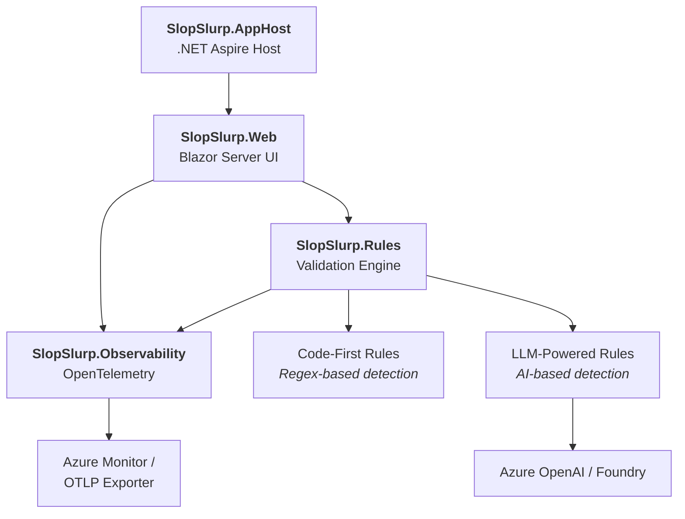

# SlopSlurp

**Your Friendly AI Writing Coach** ✨

SlopSlurp is a web application that analyzes text for common AI writing patterns — known as "tropes" or "AI-isms." Paste your text, and SlopSlurp will gently point out phrases, structures, and stylistic habits that are telltale signs of AI-generated content.

## Architecture

SlopSlurp is built with .NET 10 and organized as four projects, orchestrated by .NET Aspire:



| Project | Purpose |
|---------|---------|
| **SlopSlurp.AppHost** | .NET Aspire host that orchestrates the application |
| **SlopSlurp.Web** | Blazor Server frontend — text input, real-time progress, and violation display |
| **SlopSlurp.Rules** | Core validation engine, rule definitions, and rule implementations |
| **SlopSlurp.Observability** | OpenTelemetry setup with Azure Monitor and OTLP export support |

## How It Works

SlopSlurp uses a two-phase validation approach:

1. **Code-first rules** run first — these are fast, deterministic checks using regex patterns (e.g., detecting em-dash overuse or unicode decoration). They execute sequentially and return results instantly.

2. **LLM-powered rules** fire next — all in parallel. Each rule sends the text to an Azure OpenAI model with a focused prompt for a specific trope. As each LLM call completes, results stream back to the UI in real time.

The UI shows a progress bar as rules complete and groups violations by rule, letting you click into each finding to see the matched text highlighted in your original input.

## Getting Started

### Prerequisites

- [.NET 10 SDK](https://dotnet.microsoft.com/download/dotnet/10.0)
- An [Azure OpenAI](https://learn.microsoft.com/azure/ai-services/openai/) or [Azure AI Foundry](https://learn.microsoft.com/azure/ai-studio/) endpoint with a deployed chat model
- Azure credentials configured for `DefaultAzureCredential` (e.g., Azure CLI login)

### Run the App

```bash
# Run via the Aspire AppHost
dotnet run --project src/SlopSlurp.AppHost
```

Or run the web project directly:

```bash
dotnet run --project src/SlopSlurp.Web
```

### Run the Tests

```bash
dotnet test
```

## Configuration

The web app requires two configuration values for the AI backend. Set these in `src/SlopSlurp.Web/appsettings.json`, environment variables, or any other .NET configuration provider:

| Setting | Description |
|---------|-------------|
| `Foundry:Endpoint` | Your Azure OpenAI or Foundry endpoint URL |
| `Foundry:Model` | The deployed model name to use for LLM-powered rules |

For observability, optionally set:

| Setting | Description |
|---------|-------------|
| `OTEL_EXPORTER_OTLP_ENDPOINT` | OTLP exporter endpoint for traces, metrics, and logs |
| `APPLICATIONINSIGHTS_CONNECTION_STRING` | Azure Application Insights connection string |

## Acknowledgements

The set of AI writing tropes used by SlopSlurp is based on the catalogue published at **[tropes.fyi](https://tropes.fyi)**. Huge thanks to the folks behind that project for documenting these patterns — their work is the foundation of our rule definitions.

## License

This project is licensed under the [MIT License](LICENSE).
